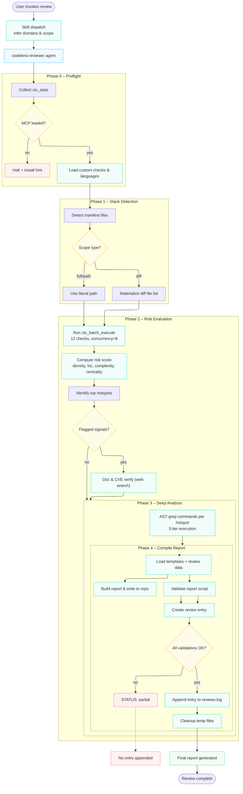

# Contributing to codelens

Thank you for contributing to codelens! This guide covers how to set up your development environment, make changes, and submit PRs.

## Development Prerequisites

Before working on codelens, ensure you have:

| Tool | Install |
|------|---------|
| [Claude Code](https://claude.ai/code) | CLI, desktop app, or IDE extension |
| [ripgrep](https://github.com/BurntSushi/ripgrep) (`rg`) | `brew install ripgrep` or `apt install ripgrep` |
| [Context7 MCP](https://github.com/nurmdrafi/codelens) | Bundled in `plugin.json` mcpServers — auto-provisions on `/plugin install codelens` |
| [context-mode MCP](https://github.com/mksglu/context-mode) | Bundled in `plugin.json` mcpServers — auto-provisions on `/plugin install codelens` |

## Quick Start

1. Fork and clone the repo
2. Edit agent/skill files (they're markdown — no build step needed)
3. Test locally (see below)
4. Submit a PR

## Branching Strategy

- Branch from `main`
- Use descriptive branch names with prefixes:
  - `feat/add-performance-domain` — new features
  - `fix/false-positive-console-log` — bug fixes
  - `docs/improve-troubleshooting` — documentation changes
- Keep PRs focused — one feature or fix per PR

## Commit Conventions

Use [Conventional Commits](https://www.conventionalcommits.org/):

```
feat: add performance domain reviewer
fix: remove false positive on test file console.log
docs: add troubleshooting section to README
```

## Adding a New Pattern Check

The single `codelens-reviewer` agent has a `<*-criteria>` block per domain. To add a new check:

1. Open `agents/codelens-reviewer.md` and find the relevant criteria block:
   - `<security-criteria>` — security patterns (OWASP)
   - `<architecture-criteria>` — architecture patterns (SOLID)
   - `<code-quality-criteria>` — code quality patterns
   - `<accessibility-criteria>` — accessibility patterns (WCAG)

2. Add your check to that block with:
   - **What to check** — specific pattern or anti-pattern
   - **Why it matters** — the risk or impact
   - **Severity guidance** — when is it Critical vs Low

3. If your check needs a new ripgrep pattern, add it to the relevant domain's pattern command in Phase 2's rg block (conditionally included when the domain is requested).

4. If the check needs Phase 3 deep-dive verification, add a matching check to the processing code template in Phase 3.

5. Test your change (see below).

## Agent Workflow (Detailed)

The full phase-by-phase workflow with all gates, retry loops, and STATUS markers. Useful when modifying the agent or debugging a failed review.



## Proposing a New Domain

To add an entirely new review domain (e.g., performance, i18n, SEO), open an issue at [github.com/nurmdrafi/codelens/issues](https://github.com/nurmdrafi/codelens/issues) with the label `new-domain` and include:

1. **Domain name** — short identifier (e.g., `performance`, `i18n`)
2. **Criteria checklist** — specific checks the domain covers, with severity rules
3. **Example patterns** — 5-10 ripgrep patterns the agent should detect
4. **Classification system** — how findings are categorized (e.g., OWASP for security, WCAG for accessibility)
5. **Expected output** — what a typical finding looks like (title, location, evidence, impact, fix)

After discussion, the domain is implemented as:
1. New `<yourdomain-criteria>` block in `agents/codelens-reviewer.md`
2. Pattern command added to Phase 2's rg block (conditionally included when the domain is requested)
3. Domain checks added to Phase 3's processing code template
4. Optionally add a preset to `config/presets.json`

Users then invoke the new domain via `/codelens:review <yourdomain>` — no new skill file needed.

## Adding Custom Checks

For company-specific or project-specific checks that can be expressed as a shell command producing a pass/fail signal, use `config/custom-checks.json`. This is the **evidence-based** path — judgment-based checks ("this abstraction is wrong") belong in the agent's `<*-criteria>` blocks, not in config.

Each entry has the shape:

```json
{
  "id": "env-example-exists",
  "domain": "security",
  "severity": "High",
  "title": ".env.example file must exist in project root",
  "detect": "test -f .env.example || echo 'MISSING .env.example'",
  "passSignal": "OK",
  "description": "Ensures developers have a template for required environment variables."
}
```

Field rules:
- `id` — kebab-case, unique. Becomes the finding's rule identifier in the report.
- `domain` — `security | architecture | quality | a11y`. Must match an active domain or the check is skipped.
- `severity` — `Critical | High | Medium | Low | Informational`.
- `detect` — shell command. Output is the evidence.
- `passSignal` — string that, if present in output, means "passed." Default `"OK"`. If `detect` outputs nothing and no `passSignal` set, treated as pass.
- `title`, `description` — human-readable, appear in the report.

Workflow:
1. Append your check to the `checks` array in `config/custom-checks.json`.
2. Validate the file: `node scripts/validate-custom-checks.js`.
3. Run `/codelens:doctor` to confirm check 18 (custom-checks.json valid) passes.
4. Run `/codelens:review <domain>` on a test repo — the check fires when its `domain` is in the active set and the `detect` output doesn't match `passSignal`.

**Trust assumption**: `detect` commands run as Bash in the user's own repo, at the same trust level as their own scripts. Don't accept `custom-checks.json` PRs from untrusted sources without reviewing the commands.

## Adding Language Support

Multi-language support is config-driven via `config/languages.json`. The `js-ts` entry is fully populated; `python` and `php` are placeholders (follow-up PRs populate them).

To add or extend a language entry:

1. Open `config/languages.json` and find (or add) the language block keyed by stack name (`js-ts`, `python`, `php`, `go`, `rust`, etc.).
2. Populate or update:
   - `extensions` — file extensions for that language.
   - `manifestFiles` — files whose presence identifies the stack (used by Phase 1 stack detection and by `/codelens:doctor`).
   - `lint`, `typecheck`, `deadCode` — each with `command`, `npxFallback`, `binaryCheck`, `notAvailableSignal`.
   - `astGrepLang` — ast-grep `-l` flag value.
   - `severityMappings` — tool rule codes → `(domain)-(severity)` strings.
   - `phase3Patterns` — ast-grep pattern IDs → pattern strings.
3. Run `/codelens:doctor` to confirm the new language is detected by its `manifestFiles`.
4. Run `/codelens:review` on a repo with that stack — Phase 1 detects the language, Phase 1+2 builds commands from config (no hardcoded tool strings), Phase 3 uses the configured ast-grep lang/patterns.

No agent edits are needed when populating a language — the agent reads `languages.json` at Phase 0.5 and drives all tool selection from it.

## Testing Locally

There are two ways to test codelens against a real codebase. The `--plugin-dir` flag is the recommended primary method — it loads the plugin for one session with no install, no copy, and no marketplace state. The `cp -r` fallback is for older Claude Code versions that lack `--plugin-dir`.

### Method 1 (recommended): `--plugin-dir` flag

Loads the plugin from its source directory for the current session only. No install, no copy, no `.claude/` modifications in the target repo. Works for both interactive and headless (`-p`) sessions.

```bash
# 1. (optional) validate the plugin manifest before launching
claude plugin validate /path/to/codelens

# 2. launch Claude Code from INSIDE the target repo with the plugin loaded
cd /path/to/test-project
claude --plugin-dir /path/to/codelens

# 3. inside Claude Code, invoke skills namespaced as /<plugin-name>:<skill-name>
/codelens:doctor                       # setup diagnostics — run this first
/codelens:review                       # full audit (bare → AskUserQuestion picker)
/codelens:review security              # single domain
/codelens:review pr-check              # preset (security + quality, diff scope)
/codelens:review all src/specific-path # path scope
/codelens:review the PR                # diff scope

# 4. after editing plugin files (hot reload — no restart needed)
/reload-plugins

# 5. debug plugin-loading issues on next launch
claude --debug --plugin-dir /path/to/codelens
```

Notes:
- Plugin name comes from `.claude-plugin/plugin.json` → `name: "codelens"`. Rename the field and the `/codelens:...` prefix changes accordingly.
- Skills are at `skills/<name>/SKILL.md`. Agents are auto-discovered from `agents/`. MCP servers are bundled in `.claude-plugin/plugin.json` `mcpServers` block — codelens ships `context-mode` and `context7`, both auto-provisioned on install.
- The target repo's `.claude/settings.local.json` controls MCP tool permissions. codelens's Phase 0–3 phases call context-mode + Context7 MCPs, so those tools must be in the target's allowlist (or approved on first use).

#### Headless smoke testing

For automated smoke tests against a target repo without an interactive session, use `claude -p` (print mode). Output goes to stdout, exit code reflects success. Useful for CI or scripted test runs:

```bash
cd /path/to/test-project

# run the full audit headlessly, capture output to a log
claude --plugin-dir /path/to/codelens -p '/codelens:review' 2>&1 | tee smoke-test.log

# single domain, fast iteration on a pattern you're developing
claude --plugin-dir /path/to/codelens -p '/codelens:review security'

# stream-json output for programmatic parsing
claude --plugin-dir /path/to/codelens -p --output-format json '/codelens:review' > result.json
```

### Method 2 (fallback): copy into `.claude/`

For Claude Code versions without `--plugin-dir`, copy `agents/` and `skills/` into the target repo's `.claude/` directory. This is more invasive — it writes into the target repo and requires a re-copy after every change.

```bash
# 1. copy the plugin files into the target's .claude/ directory
cp -r /path/to/codelens/agents/ /path/to/test-project/.claude/
cp -r /path/to/codelens/skills/ /path/to/test-project/.claude/

# 2. launch Claude Code normally — skills are auto-discovered
cd /path/to/test-project
claude

# 3. invoke as Method 1 (commands are identical once loaded)
/codelens:review
```

⚠️ **Caveats:**
- If the target repo already has `.claude/settings.local.json`, do not overwrite it — only merge the codelens MCP permissions in.
- After every edit to codelens source, re-copy the changed files (`cp -r` again) since the target's `.claude/` is a snapshot.
- Clean up: `rm -rf /path/to/test-project/.claude/agents/codelens-reviewer.md /path/to/test-project/.claude/skills/{review,doctor}` when finished.

### Verifying the report

Regardless of method, after `/codelens:review` completes check:
- Does your new pattern appear in findings?
- Is the severity correct?
- Is the evidence accurate (file path, line number, code snippet)?
- Does the fix suggestion make sense?
- For the reviews log: did `.codelens/reviews.log` get one entry appended with the expected 12 fields (`schema`, `ts`, `scope`, `crit`, `high`, `med`, `low`, `info`, `report`, `v`, `tokIn`, `tokOut`) with `schema: "1"` required? Run `node scripts/validate-entry.js <entry.json>` to confirm contract compliance.

### Edge Cases to Test

- **Empty/small repos** — should complete with "no findings" or minimal findings
- **Non-JS/TS codebases** — Python, Go, Ruby files should still produce pattern matches
- **Large files** — scanner should handle 500+ line files without errors
- **Diff scope** — `pr-check` should only flag issues in changed files

## Reporting Issues

Open an issue at [github.com/nurmdrafi/codelens/issues](https://github.com/nurmdrafi/codelens/issues):

### False Positives
If codelens reports a finding that isn't actually an issue:
- Label: `false-positive`
- Include: the finding (title, location, evidence), why it's incorrect, what the correct behavior should be

### Missing Patterns
If codelens misses something it should catch:
- Label: `missing-pattern`
- Include: the pattern it should detect, a code example, which domain it belongs to, expected severity

## PR Guidelines

- Keep PRs focused — one feature or fix per PR
- Test against a real codebase before submitting
- Include a description of what changed and why
- If modifying report format, include a sample output snippet
- Follow commit conventions (see above)

## Background Reading

The `archive/` directory contains the original agents and design docs that codelens was built from. Useful for understanding the design decisions:

- `archive/agents/full-codebase-reviewer.md` — the monolithic agent that was decomposed into the pipeline
- `archive/agents/security-auditor.md`, `architect-reviewer.md`, `code-reviewer.md`, `accessibility-reviewer.md` — the original 4 separate agents
- `archive/reports/codelens-reviewer-refactor-spec-v3-addendum.md` — prior-version multi-stack refactor design (deferred)
- `archive/reports/codelens-reviewer-tool-validation.md` — prior-version tool-validation work

## File Structure Reference

```
agents/
  codelens-reviewer.md     # Single domain-aware agent (scans, analyzes, compiles)
                           # Contains <security-criteria>, <architecture-criteria>,
                           # <code-quality-criteria>, <accessibility-criteria> blocks
                           # plus the 5-phase workflow (Phase 0 preflight → Phase 4 report)
skills/
  review/SKILL.md              # /codelens:review — single NL-driven entry point (all domains + scopes)
  doctor/SKILL.md              # /codelens:doctor (setup diagnostics)
config/
  presets.json                 # Default presets (pr-check, a11y-audit, full-audit)
  exclusions.json              # Exclusion patterns (defaults + byDomain + keepInScope)
templates/                       # Output contracts (agent-loaded at Phase 4)
  report.md                    # Markdown report template (placeholder skeleton)
  reviews-entry.json           # Flat 12-field entry shape for .codelens/reviews.log (schema required, v1)
  custom-checks.json          # (Part H) Evidence-based company-specific checks
  languages.json              # (Part I) Multi-language mechanism: JS/TS populated, Python/PHP placeholders
  README.md                    # Abstraction rules + translation maps
.claude-plugin/
  plugin.json                  # Plugin manifest
  marketplace.json             # Marketplace listing
references/                       # Local-only design references (gitignored)
  codebase-analyzer.md             # Structural pattern the agent body follows
scripts/
  bench-phase.sh               # Benchmark harness
  bench-mcp-settings.json      # MCP allowlist for headless bench runs
archive/                       # Prior-version artifacts (shipped for reference)
  agents/                      # Superseded agent bodies from v1.x
  reports/                     # Prior-version design docs
docs/
  smoke-tests/                 # End-to-end test runs (reference for refactoring)
CLAUDE.md                  # Project instructions for Claude Code
```
