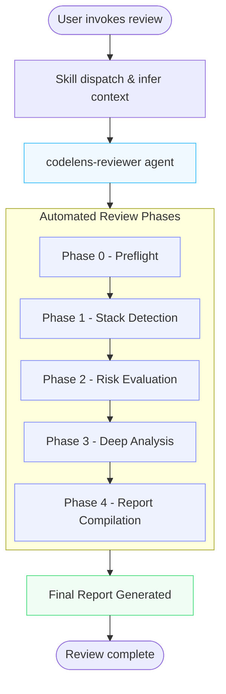

# codelens

[](https://opensource.org/licenses/MIT) [](https://github.com/nurmdrafi/codelens) [](https://github.com/nurmdrafi/codelens/stargazers) [](https://github.com/nurmdrafi/codelens/graphs/contributors)

> **AI code review is not a substitute for human review.** Automated tools miss context, produce false positives, and cannot fully understand business logic or user experience. Always verify findings with manual code review. This tool is a starting point, not a final verdict.

**An open-source Claude Code plugin that performs multi-domain code review — security, architecture, code quality, and accessibility — on your full repo, a module, or a PR diff.**

Built on a token-efficient 3-phase pipeline that reads files once and shares extraction data across all domain reviewers.

> **v0.0.10 (beta — no backward compatibility guaranteed)** — install is now self-contained (MCP servers bundled, npm CLIs auto-fetched via `npx`), the agent is config-driven extensible (`config/custom-checks.json`, `config/languages.json`), and the doctor is stack-aware. The `reviews.log` shape may change before v1.0. See `CHANGELOG.md` for the full change list.

> **We want contributors!** If you care about code quality, security, or accessibility, please consider [submitting a PR](CONTRIBUTING.md). Every new pattern check helps developers ship better software.

---

## The Problem

Code review is essential but inconsistent. Security vulnerabilities slip through. Accessibility is an afterthought. Architecture drifts. Developers review code under time pressure and miss things — especially outside their domain of expertise. A frontend developer may catch CSS issues but miss a SQL injection. A backend developer may catch API design flaws but miss missing ARIA labels.

Even with linters and CI checks, significant issues evade detection because they require **cross-domain understanding** — a security issue that's also an architecture problem, an accessibility gap that's also a code quality issue.

## The Solution

**codelens** runs as **one domain-aware agent** (`codelens-reviewer`) behind **two thin dispatcher skills** (`/codelens:review`, `/codelens:doctor`). The `/codelens:review` dispatcher resolves your intent — which domains, which scope — from natural language and passes a literal config to the agent, which executes it verbatim. Coverage spans all four review perspectives:

- **Security** — OWASP Top 10 classification with Context7-powered CVE verification
- **Architecture** — SOLID compliance, dependency analysis, pattern verification
- **Code quality** — Complexity scoring, duplication detection, async pattern analysis
- **Accessibility** — WCAG 2.1 AA compliance, keyboard navigation, screen reader compatibility

The single agent reads each source file exactly once and analyzes all requested domains in that one pass — no multi-agent coordination tax, no re-reading. Cross-domain deduplication and severity-first report compilation happen in the same context.

## Agent Inventory

| Agent | Purpose | File |
|-------|---------|------|
| `codelens-reviewer` | Single domain-aware agent: scans, analyzes all requested domains in one pass, compiles report. Absorbs the former scanner + 4 reviewers + orchestrator. | `agents/codelens-reviewer.md` |

The 2 `/codelens:*` skills are thin dispatch wrappers. `/codelens:review` resolves `{domains, scope, scopeTarget, outputFile}` from natural language and invokes this single agent; `/codelens:doctor` runs setup diagnostics.

## Documentation

| Guide | What It Covers |
|-------|----------------|
| [CONTRIBUTING.md](CONTRIBUTING.md) | Development setup, adding patterns, proposing domains, testing locally |
| [CLAUDE.md](CLAUDE.md) | Project architecture, conventions, constraints, common workflows |
| [templates/report.md](templates/report.md) | Report template with embedded worked example — the shape every review follows |
| [CHANGELOG.md](CHANGELOG.md) | Release history and version changes |

---

## Install

```
/plugin marketplace add nurmdrafi/codelens
/plugin install codelens
```

That single command provisions everything codelens needs:

- **MCP servers** (`context-mode`, `context7`) auto-install via the `mcpServers` block in `plugin.json` — no separate `/plugin install context-mode` or `/plugin install context7` needed.
- **npm CLIs** (biome, fallow, tsc, ast-grep) auto-fetch via `npx` on first use with a `command -v <binary>` fast-path. Pre-installing them is faster but optional.
- **`rg` (ripgrep)** is the one prerequisite codelens can't bundle — it's a native binary with a per-OS/arch install matrix.

```bash
# ripgrep — macOS
brew install ripgrep

# ripgrep — Ubuntu/Debian
sudo apt install ripgrep

# ripgrep — Windows
winget install BurntSushi.ripgrep.MSVC
```

Requires [Claude Code](https://claude.ai/code) CLI, desktop app, or IDE extension. After install, run `/codelens:doctor` to confirm everything is wired up.

## Quick Start

```bash
# Full review — all four domains, entire codebase
/codelens:review

# Security-only review (NL variants — model resolves any of these)
/codelens:review security
/codelens:review only security
/codelens:review full codebase only for security

# PR review — model detects "PR"/"diff" intent
/codelens:review the PR
/codelens:review main..HEAD

# Setup diagnostics + fix commands
/codelens:doctor
```

After scanning, codelens writes a report at your project root: `<DOMAIN>_REPORT.md` for single-domain runs (e.g. `SECURITY_REPORT.md`), `CODEBASE_ANALYSIS_REPORT.md` for multi-domain full/path reviews, or `PR_REVIEW_<range>.md` for diff reviews — all with findings organized by severity.

## Optional Tools

codelens integrates **four** purpose-built tools on JS/TS codebases. None are required — all auto-fetch via `npx` on first use if not pre-installed, and codelens runs to completion with zero of them on disk. Pre-installing skips the 5–30s first-run `npx` fetch.

### Biome (lint + accessibility + complexity)

```bash
npm install -g @biomejs/biome      # optional — npx fetches it otherwise
```

Provides 490+ lint rules covering correctness, suspicious patterns, complexity, performance, style, and 15+ JSX/HTML accessibility checks. In Phase 2 the agent pipes Biome's JSON output for the complexity signal used in hotspot ranking; in Phase 4 the rule categories map to severity (a11y → High, correctness/suspicious → Quality, complexity → Medium, style → Low). Catches SVG accessibility, noArrayIndexKey, noDangerouslySetInnerHtml, and many others rg patterns miss.

### fallow (codebase intelligence)

```bash
npm install -g fallow              # optional — npx fetches it otherwise
```

Rust-native AST analysis. Adds dead-code detection (unused files/exports/dependencies), token-based duplication, complexity hotspot scoring, circular dependency detection, and a project maintainability health score. Phase 2 runs three fallow subcommands (`dead-code`, `health`, `dupes`); Phase 4 maps the outputs — circular deps → Architecture High, low maintainability → Architecture Medium, dead-code/dupes → Quality Medium.

### TypeScript Compiler (semantic type analysis)

```bash
# project-local (recommended — matches your tsconfig)
npm install -D typescript
```

Adds TypeScript semantic analysis that static linters cannot reach. Phase 2 runs `tsc --noEmit --skipLibCheck` (tries `./node_modules/.bin/tsc` first, falls back to `npx --package=typescript tsc`). Phase 4 maps: `TS2xxx` type errors and `TS2531/2532` null/undefined dereference → Quality High; `TS6133` unused locals and `TS2304/2307` missing name/module → Quality Medium.

### ast-grep (structural search)

```bash
npm install -g @ast-grep/cli       # optional — npx fetches it otherwise
```

AST-based pattern matching — understands JSX/TS syntax rather than treating code as text. Phase 3 uses ast-grep for the per-hotspot deep-dive (xss/eval/empty-catch/a11y patterns). When ast-grep is missing, Phase 3 transparently falls back to rg via an availability check (`command -v sg`). Findings are still produced — just line-based rather than syntax-aware, so precision on edge cases (e.g. `dangerouslySetInnerHTML` inside string literals) is lower.

### Stack-aware behavior

The doctor detects your project's stack (js-ts / python / php / go / rust / unknown) and only checks the tools relevant to that stack. On a Python repo, for example, biome/tsc/fallow/ast-grep checks are skipped with `[SKIP]` — not warnings.

### Without these tools

codelens runs fine with any subset (or none) pre-installed. Per-tool fallback behavior:

- **Biome missing** → auto-fetched via `npx` on first use, or complexity signal zeroed if `npx` also unavailable. Hotspot ranking re-weights the remaining three signals (loc, finding density, import centrality). Lint/a11y findings via rg patterns.
- **fallow missing** → auto-fetched via `npx`, or dead-code/duplication/maintainability signals skipped.
- **TypeScript missing** → auto-fetched via `npx`, or no TS semantic findings. JS-only codebases are unaffected.
- **ast-grep missing** → auto-fetched via `npx`, or Phase 3 uses rg fallback. Same finding categories, slightly lower precision.

No errors, no degraded core review — just narrower coverage. Run `/codelens:doctor` to see which optional tools are detected and which stack was identified.

## Commands

| Command | Purpose |
|---|---|
| `/codelens:review` | Multi-domain review (any subset of security, architecture, quality, a11y) on full repo, path, or diff scope |
| `/codelens:doctor` | Setup diagnostics + fix commands |

**Coming soon:** `/codelens:fix-*` for automated remediation.

### Path Scope

Mention a directory or file in your prompt:
- `/codelens:review src/lib/payments` — full review scoped to a path
- `/codelens:review security src/auth` — security review of one module

### Domain Subset

Name the domains you want in plain language:
- `/codelens:review security quality` — only security + quality sections
- `/codelens:review a11y` — single domain
- `/codelens:review security architecture src/lib` — combine with path scope
- Unspecified → all four domains

### Diff Scope (PR review)

Mention "PR", "diff", "changes", or a range:
- `/codelens:review the PR` — defaults to `main..HEAD`, all four domains
- `/codelens:review abc123..def456` — specific commit range
- `/codelens:review main..feature-x for security and quality` — combine with domain subset
- `/codelens:review abc123` (single SHA) — expands to `abc123^..abc123`

### Presets

Presets define domain + scope combinations referenced by name in your prompt. `/codelens:review pr-check` loads the `pr-check` preset. Built-in presets:

| Preset | Domains | Scope |
|--------|---------|-------|
| `pr-check` | security, code-quality | diff |
| `a11y-audit` | accessibility | full |
| `full-audit` | all | full |

Create `config/presets.json` in your project to override or add presets:

```json
{
  "my-preset": {
    "domains": ["security", "accessibility"],
    "scope": "path",
    "scopeTarget": "src/components"
  }
}
```

## Domains Covered

### Security ([OWASP Top 10](https://owasp.org/Top10/))
Evaluates against [OWASP Top 10 (2021)](https://owasp.org/Top10/): broken access control (A01), cryptographic failures (A02), injection (A03), insecure design (A04), security misconfiguration (A05), vulnerable components (A06), authentication failures (A07), data integrity failures (A08), logging failures (A09), and SSRF (A10).

### Architecture ([SOLID](https://en.wikipedia.org/wiki/SOLID) + Patterns)
Evaluates pattern adherence, [SOLID compliance](https://en.wikipedia.org/wiki/SOLID) (single responsibility, open/closed, Liskov substitution, interface segregation, dependency inversion), dependency direction, abstraction levels, service boundaries, data flow, state management, scalability, and maintainability.

### Code Quality
Evaluates logic correctness, error handling at system boundaries, resource management, naming clarity, cyclomatic complexity (<10), duplication, DRY without premature abstraction, performance, async patterns, and test coverage.

### Accessibility ([WCAG 2.1 AA](https://www.w3.org/TR/WCAG21/))
Evaluates keyboard navigation, screen reader compatibility, visual/color contrast, [ARIA attributes](https://developer.mozilla.org/en-US/docs/Web/Accessibility/ARIA), form labeling, heading hierarchy, focus management, and dynamic content announcements against [WCAG 2.1 AA](https://www.w3.org/TR/WCAG21/) standards.

## How It Works



codelens runs as a **single agent** with **dispatcher-side intent resolution**. When you invoke `/codelens:review`, the skill reads your prompt and resolves which domains and scope you requested, then passes a literal config to the agent — it builds a command list containing only the requested domains' patterns, scoped to your path or diff. The agent executes that list verbatim.

This follows Anthropic's [Building Effective Agents](https://www.anthropic.com/research/building-effective-agents) guidance: code review is a *well-defined task*, so it should be a *workflow* (predefined code paths) with deterministic filtering in the dispatcher, not agent discretion. The agent cannot analyze a domain you didn't request or scan outside your scope — those commands simply aren't in the config it receives.

**Dispatcher (skill) — runs before the agent:**
1. Reads your prompt (`/codelens:review security src/auth` → domains=`["security"]`, scope=`path`, scopeTarget=`src/auth`)
2. Builds the minimal config `{domains, scope, scopeTarget, outputFile}` and dispatches the agent. If any field is ambiguous, asks via `AskUserQuestion` first.

**Agent (codelens-reviewer) — single continuous turn:**

**Phase 0:** `ctx_stats` confirms context-mode MCP is loaded.

**Phase 0.5:** One `ctx_execute` loads `config/custom-checks.json` and `config/languages.json` (skipped silently if absent).

**Phase 1+2 — Inventory + Patterns + Risk Signals (single batch):** Stack detection (config-driven via `languages.json`), file inventory, per-domain rg patterns, complexity/finding-density/centrality/loc signals, and custom-check detections all run in ONE `ctx_batch_execute` (concurrency 8). Scope resolution runs first, then exclusions from `config/exclusions.json` are baked into `-g '!...'` flags. Results auto-indexed; previews enter context, raw bytes stay out. One `ctx_execute` post-processor computes the Risk Score (`0.4×finding_density + 0.2×loc + 0.2×complexity + 0.2×import_centrality`) and selects the top 10–15 hotspots.

**Phase 2.5 — Doc & CVE Verification (on-flag):** Context7 + WebSearch only when Phase 2 flags suspect libraries. Skipped entirely if nothing flag-worthy was found.

**Phase 3 — Hotspot Deep-Dive (single batch):** ALL hotspots processed in ONE `ctx_batch_execute` (concurrency 8) — accumulate per-file ast-grep commands (with rg fallback) into a single batch, run once, reason across all results. Patterns come from `languages[primaryLang].phase3Patterns` (config-driven, not inlined); unknown stacks skip ast-grep and fall back to rg-only. No regex matching in the prompt — the model reads indexed tool output and assigns severity.

**Phase 4 — Compile Report:** Three structural `STATUS:` gates (`gates-loaded`, `report-ok`, `entry-ok`) print in strict order before any file is written. Native `Write` to the report file at repo root. Severity-first ordering, cross-domain dedup (same `file:line` ±2 lines merged). Appends one 12-field entry (`schema`, `ts`, `scope`, `crit`, `high`, `med`, `low`, `info`, `report`, `v`, `tokIn`, `tokOut`) with `schema: "1"` required to `.codelens/reviews.log`.

The agent is **stateless across reviews**: no persisted intermediate JSON, no `_methodology` self-reports. Structural guarantees are encoded as imperative constraints in the agent body. **Phase 4 is the exception** — the three `STATUS:` markers must print in order before the entry is appended, so output drift fails loud, not silent.

## Report Preview

codelens produces a severity-first markdown report at your project root:

```markdown
# Codebase Analysis Report: my-app

**Date:** 2026-06-12
**Stack:** React 18 · TypeScript · Tailwind CSS · Redux Toolkit
**Domains:** security, architecture, code-quality, accessibility

---

## Executive Summary

**Security:** 2 Critical, 3 High. Weak auth secret and client-side encryption key exposure.
**Architecture:** Clean server/client boundary, but carries tech debt in duplicated data-fetching paths.
**Code Quality:** Strong type safety, but 15+ debug console.log statements in production code.
**Accessibility:** Significant WCAG gaps — 92% of buttons missing accessible names.

---

## Critical (2)

| # | Domain | Issue | Location |
|---|--------|-------|----------|
| 1 | Security | **Weak AUTH_SECRET** — Guessable string allows JWT forgery | `.env:2` |
| 2 | A11y | **No skip link or <main> landmark** — Keyboard users cannot bypass nav | `app/layout.tsx` |

### Details

**1. Weak AUTH_SECRET**
- **OWASP:** A02:2021 – Cryptographic Failures
- **Evidence:** `AUTH_SECRET=my-app-secret-2024`
- **Impact:** Attacker can forge session tokens, impersonate users.
- **Fix:** Generate with `openssl rand -base64 48`. Rotate immediately.
```

See [`templates/report.md`](templates/report.md) for the report template — includes a fully-worked example at the bottom showing the exact shape every review follows.

## Troubleshooting

### "ripgrep not found" or `rg` errors
Install ripgrep: `brew install ripgrep` (macOS) or `apt install ripgrep` (Linux).

### "context-mode MCP not connected"
The pipeline requires context-mode for sandboxed extraction. Without it, agents fall back to raw tools (higher token usage, slower). Both MCP servers are bundled in `plugin.json` — reinstall the plugin to re-trigger provisioning:
```
/plugin install codelens
```
Then restart your Claude Code session.

### "Context7 MCP not connected"
The `codelens-reviewer` agent needs Context7 for library verification. Context7 is bundled in `plugin.json` — reinstall the plugin to re-trigger provisioning:
```
/plugin install codelens
```
Then restart your Claude Code session.

### Review produces no findings
- Verify the scan path contains source files (not just config/data files)
- Run `/codelens:review` (no args) for a full scan instead of a single domain
- Check that the path scope matches actual file locations

### Too many false positives
- Use path scope: `/codelens:review security src/specific-path` to narrow scope
- Edit the criteria blocks in `agents/codelens-reviewer.md` to remove patterns that don't apply to your stack
- Create a `config/presets.json` with domains relevant to your project

### Review is slow on large repos
- Use path scope: `/codelens:review src/module` instead of scanning the whole repo
- Use diff scope for PRs: `/codelens:review the PR` only scans changed files
- The single-pass pipeline already minimizes token cost — large repos simply take longer

## FAQ

**Does it work on non-JS/TS codebases?**
Yes. The pattern matching works on any language (Python, Go, Ruby, etc.). The JS/TS-specific patterns (React hooks, Next.js config) produce fewer findings on other stacks. Security and accessibility patterns are language-agnostic.

**How long does a review take?**
Depends on repo size. A 100-file project takes ~2-3 minutes. A 1000-file project can take 5-10 minutes. Diff-scoped reviews (`pr-check`) are faster since they only scan changed files.

**Can I use it in CI/CD?**
Not yet — this is planned. The current design requires an interactive Claude Code session. A GitHub Action wrapper is on the roadmap.

**How do I suppress false positives?**
Edit the relevant `<*-criteria>` block in `agents/codelens-reviewer.md` to remove or adjust the pattern that triggered the false positive. Each block lists all checks — comment out or modify the ones that don't apply to your stack.

**What about large monorepos?**
Use path scope to scan specific packages: `/codelens:review packages/auth`. The single-pass agent handles large file counts efficiently, but scanning an entire monorepo at once consumes more tokens.

**Can I add custom domains?**
Yes. See [CONTRIBUTING.md](CONTRIBUTING.md) for the process: add a new `<yourdomain-criteria>` block to `agents/codelens-reviewer.md`, add a pattern command to Phase 2, and add domain checks to Phase 3's processing code.

## Architecture

```
codelens/
├── .claude-plugin/
│   ├── plugin.json            # Plugin manifest
│   └── marketplace.json       # Marketplace listing
├── skills/
│   ├── review/
│   │   └── SKILL.md           # /codelens:review (all domains + scopes, NL-driven)
│   └── doctor/
│       └── SKILL.md           # /codelens:doctor
├── agents/
│   └── codelens-reviewer.md   # Single domain-aware agent (scans, analyzes, compiles)
├── config/
│   ├── presets.json           # Default presets (pr-check, a11y-audit, full-audit)
│   └── exclusions.json        # Exclusion patterns (defaults + byDomain + keepInScope)
├── templates/                   # Output contracts (agent-loaded at Phase 4)
│   ├── report.md              # Markdown report template (placeholder skeleton)
│   ├── reviews-entry.json     # Flat 12-field entry shape for .codelens/reviews.log (schema required, v1)
│   └── README.md              # Abstraction rules + translation maps
├── references/                   # Local-only design references (gitignored)
│   └── codebase-analyzer.md   # Structural pattern the agent body follows
├── scripts/
│   ├── bench-phase.sh         # Benchmark harness
│   └── bench-mcp-settings.json  # MCP allowlist for headless bench runs
├── archive/                   # Prior-version artifacts (shipped for reference)
├── CLAUDE.md                  # Project instructions for Claude Code
└── CONTRIBUTING.md            # Contribution guidelines
```

## Customization

### Add/Modify Presets
Edit `config/presets.json` in your project.

### Modify Domain Criteria
All four domains' criteria live in `agents/codelens-reviewer.md` as `<security-criteria>`, `<architecture-criteria>`, `<code-quality-criteria>`, `<accessibility-criteria>` blocks. Edit the relevant block to add/remove checks.

### Report Format
The report template lives at `templates/report.md` — a placeholder skeleton with a fully-worked example embedded. The agent loads it at Phase 4 and pattern-matches against the example. Modify section structure, severity names, or output format there.

## Contributing

See [CONTRIBUTING.md](CONTRIBUTING.md) for guidelines on:
- Adding new pattern checks to domain agents
- Testing changes locally
- Reporting false positives or missing patterns
- Proposing new domains

PRs welcome! Especially for:
- New domain-specific patterns (security, a11y, architecture, quality)
- New presets for common workflows
- False positive reports with reproduction steps

## License

[MIT](LICENSE) © 2026 nurmdrafi
