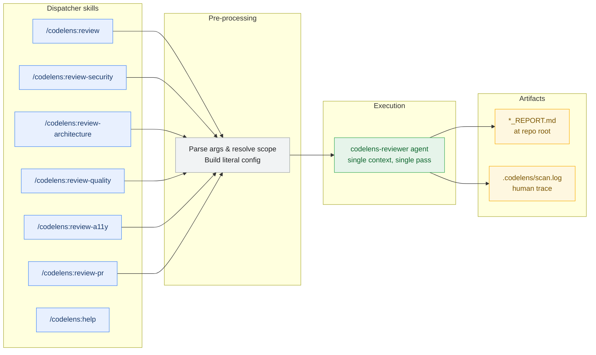
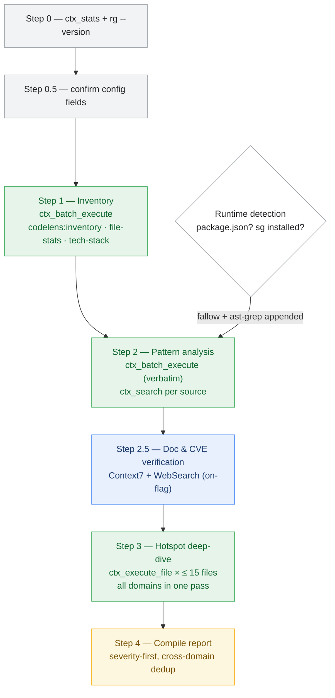

# Codelens Pipeline Diagram

Developer reference for reasoning about the codelens review flow. Not consumed by any agent.

## Architecture

Codelens runs as **one agent** (`codelens-reviewer`) behind **seven thin dispatcher skills**. The skills pre-filter everything — which domains, which scope, which optional analyzers — so the agent receives a literal config and executes it verbatim.

This follows Anthropic's [Building Effective Agents](https://www.anthropic.com/research/building-effective-agents) guidance: code review is a *well-defined task*, so it should be a *workflow* (predefined code paths) with deterministic filtering in the dispatcher, not agent discretion.

### System overview

The shape of a review: dispatcher skills pre-process the request, the agent runs, two artifacts land at repo root.

The dispatcher builds a `{scope, scopePath, outputFile, step2Commands, step2Sources, step2Queries, step3Checks, criteriaDomains}` config object and passes it to the agent. The agent cannot analyze a non-requested domain or scan outside the resolved scope — those commands aren't in the config.

### Agent execution detail

What happens inside the agent invocation. Each step has one job and reads each source file at most once.

Step 2 consumes `config.step2Queries[i]` verbatim for `ctx_search` — the agent never improvises query strings. The runtime-detection branch reflects that fallow and ast-grep commands, when present, flow through Step 2 like any other source — the agent does not special-case them.

## What lands where

| Artifact | Location | Notes |
|---|---|---|
| Pattern matches | index: `codelens:<domain>-patterns` | auto-indexed by `ctx_batch_execute` labels; one source per requested domain (filtered by the skill) |
| Inventory + file stats | index: `codelens:inventory`, `codelens:file-stats`, `codelens:tech-stack` | auto-indexed |
| Hotspot file contents | index: `codelens:file:<path>` | single-pass, Step 3 only; auto-indexed via `intent` param |
| Scanner trace | `.codelens/scan.log` | human-readable, NOT agent-consumed |
| Final report | repo root (`*_REPORT.md` or `PR_REVIEW_*.md`) | user-facing |

## Key invariants

1. **One agent context.** The entire review runs in a single agent invocation. No subagent dispatch, no cross-context handoff. This is the structural fix for the re-read coordination problem — there's no second context to lose track of what's been read.

2. **Single-pass source reading.** Source files are read exactly once — by Step 3's hotspot deep-dive (max 15 files). Each `ctx_execute_file` call's processing code runs only the `if (CHECKS.includes(...))` branches for requested domains. Pattern evidence comes via `ctx_search` against auto-indexed Step 2 output, never re-reading source.

3. **Domain filtering is structural.** The skill builds `step2Commands`, `step2Sources`, `step2Queries`, and `step3Checks` BEFORE dispatch (all four positionally linked). The agent emits `config.step2Commands` verbatim in Step 2, consumes `config.step2Queries[i]` verbatim for `ctx_search`, and substitutes `config.step3Checks` into Step 3's processing code. The agent literally cannot run a non-requested domain — the command and the check id aren't in the config. `/codelens:review-security` runs exactly ONE rg command and ONE Step 3 branch.

4. **Scope filtering is structural.** The skill resolves `scopePath` upfront (full → `.`, path → the path string, diff → literal file list from `git diff --name-only`) and bakes it into every command in `step2Commands`. The agent never computes scope — it receives it.

5. **Mandatory `ctx_batch_execute`.** Steps 1 and 2 run via `ctx_batch_execute` (host shell where `rg` is on PATH). No raw Bash pattern searches.

6. **No token counts in the report.** The Methodology section documents scope/files/tools — not cost.

## Why this design (research grounding)

From Anthropic's [Building Effective Agents](https://www.anthropic.com/research/building-effective-agents):
> "**Workflows** are systems where LLMs and tools are orchestrated through **predefined code paths**."
> "**Workflows offer predictability and consistency for well-defined tasks**, whereas agents are the better option when flexibility and model-driven decision-making is needed."

Code review is a well-defined task — domains and scope are known at dispatch time, not discovered mid-run. The deterministic parts (which rg commands, which file list) belong in the dispatcher, not in agent discretion.

From Anthropic's [multi-agent research system](https://www.anthropic.com/engineering/multi-agent-research-system) post:
> "multi-agent systems use about **15× more tokens** than chats"
> "some domains that require all agents to share the same context... are not a good fit for multi-agent systems today. For instance, **most coding tasks** involve fewer truly parallelizable tasks than research"

Code review shares the same file context across all domains, so the former 6-agent pipeline paid the multi-agent tax without real parallelism benefit.
